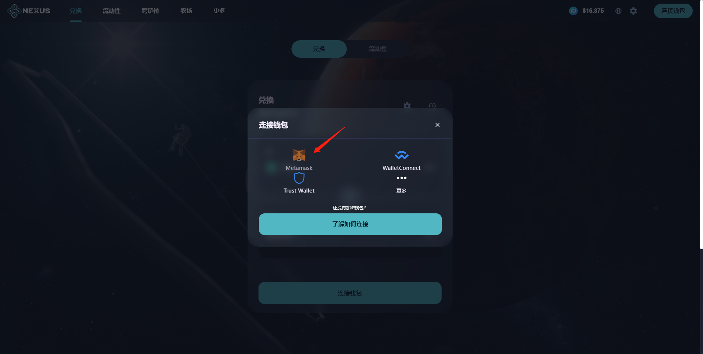
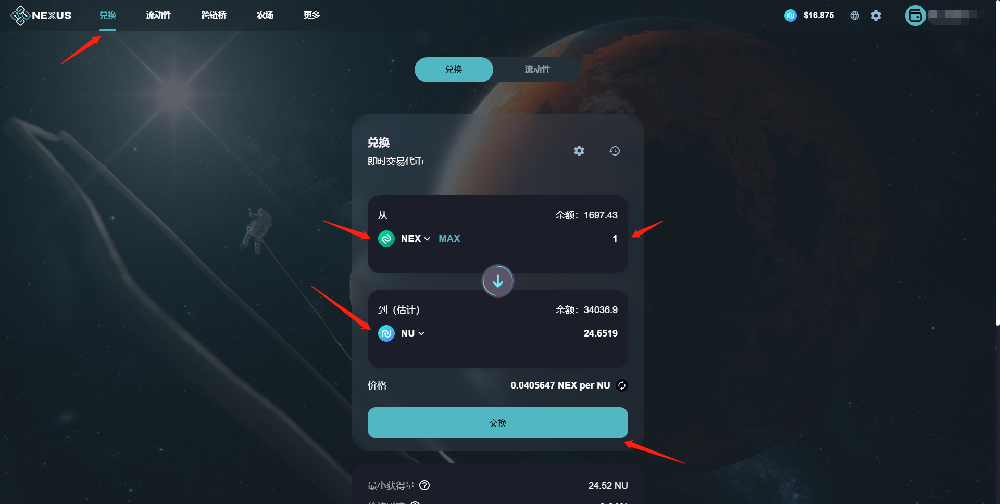
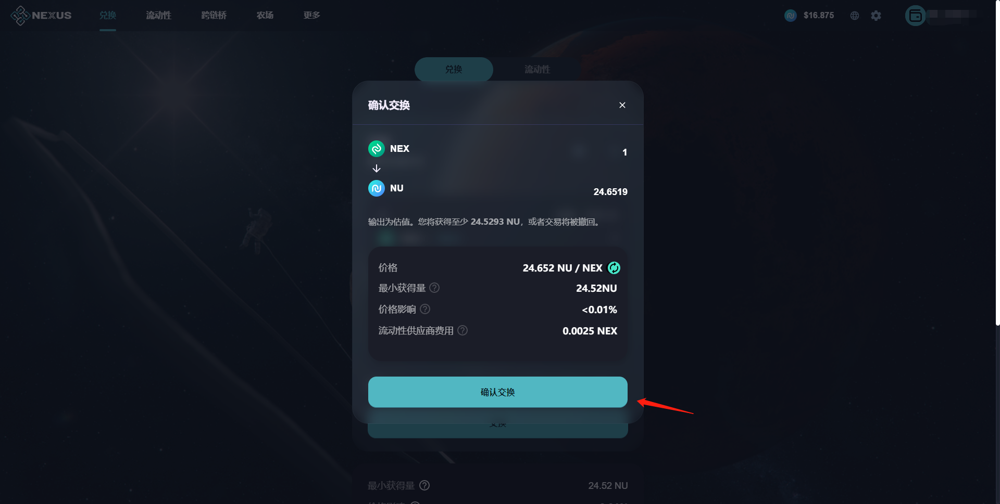
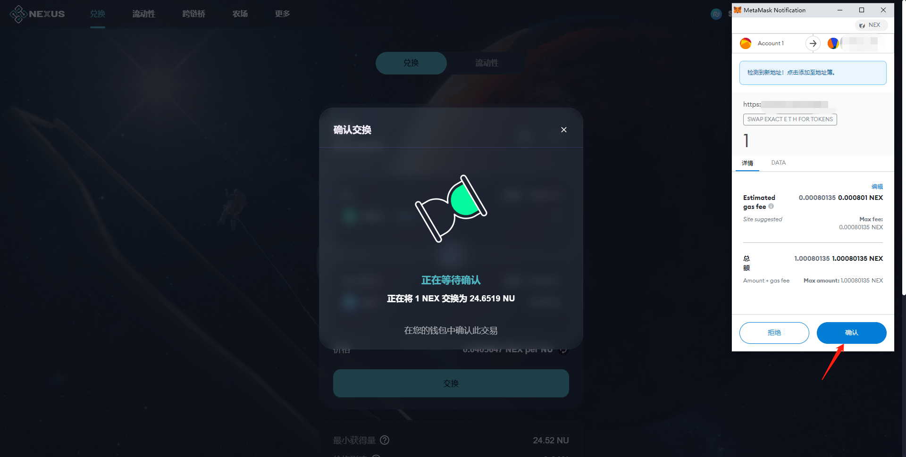
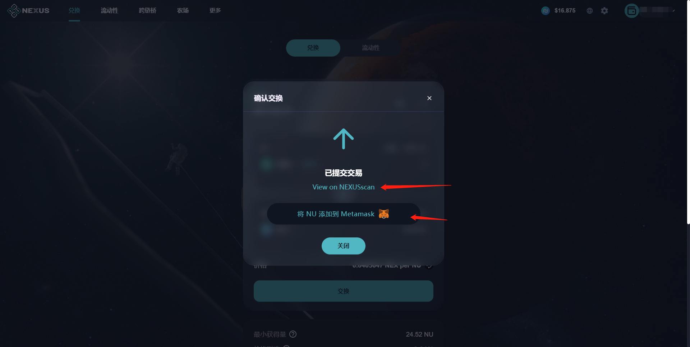
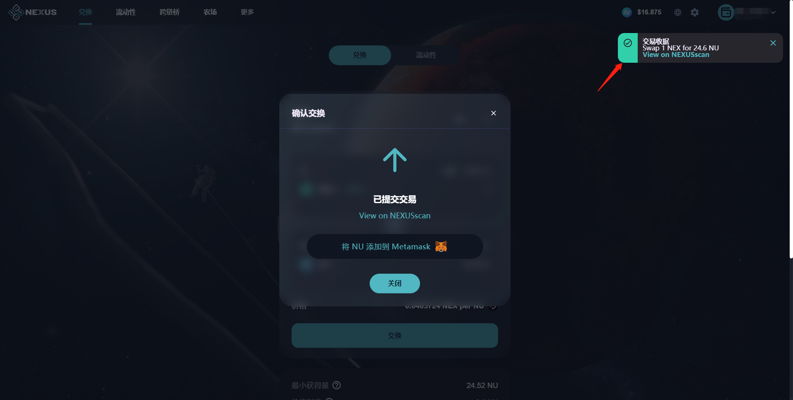

# 🔄 兑换

兑换产品使任意用户只要钱包有币，即可在NexusSwap上任意币对的币币交易，完全去中心化，代币都在您的钱包地址中，安全可靠；

### 操作步骤

#### 1、点击【连接钱包】按钮，弹出连接钱包弹窗，选择MetaMask钱包进行连接，钱包正确连接后，即可进行兑换操作，无需注册。

.png>)

#### 2、在页面中，选择兑换产品，选择想要兑换的币对，输入正确有效的数量，点击【交换】按钮

#### 3、在兑换确认弹窗中，点击【确认交换】按钮，弹出钱包应用的交易确认弹窗，点击【确认】按钮，确认交易；

#### 4、钱包确认后，等待区块确认。页面弹窗中，点击【View on NEXUSscan】按钮，可在区块浏览器中，查看交易详情；也可将新兑换的代币，添加到钱包应用中。

#### 5、区块确认完成后，页面右上角弹出交易收据小弹窗，即代表已兑换成功，点击弹窗中“View on NEXUSscan”，打开新窗口跳转区块链浏览器页面，查看该兑换操作的交易详情。

