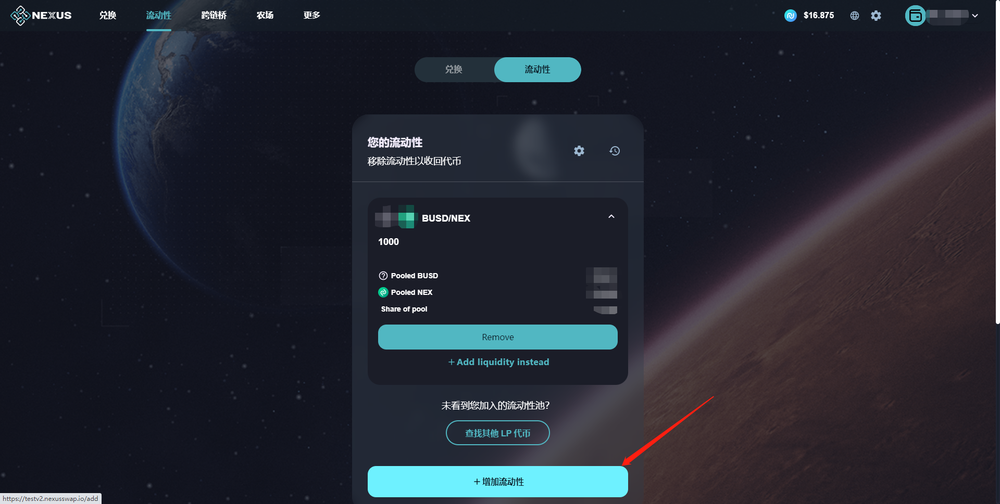
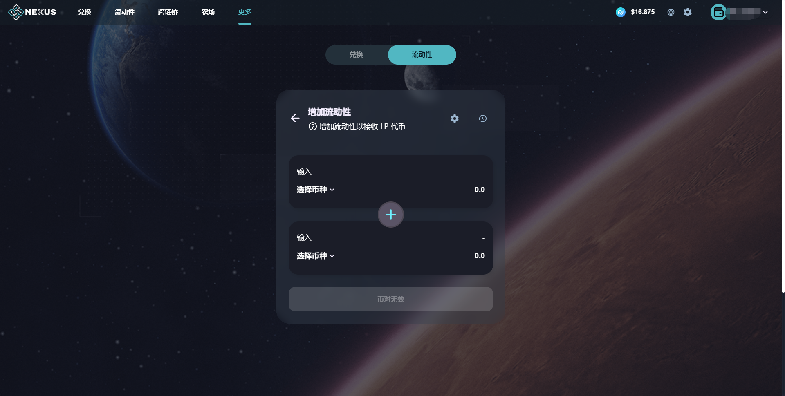
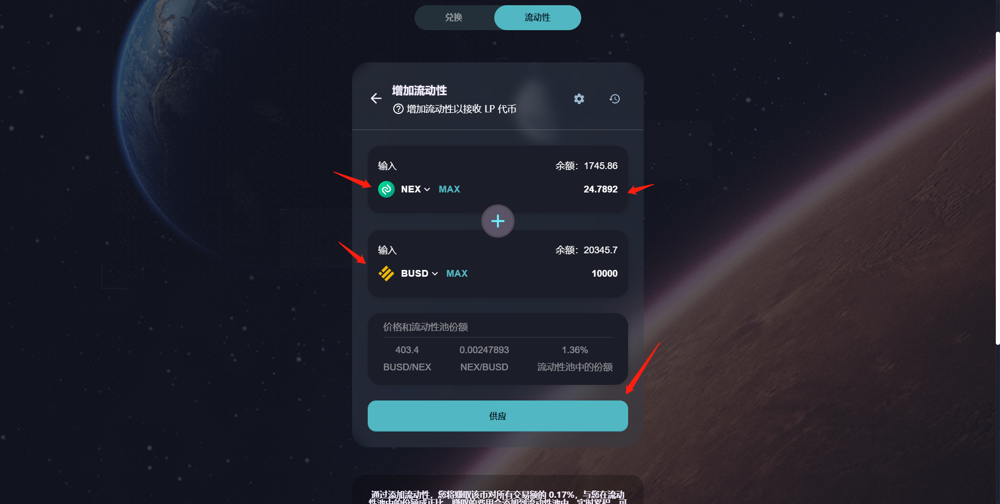
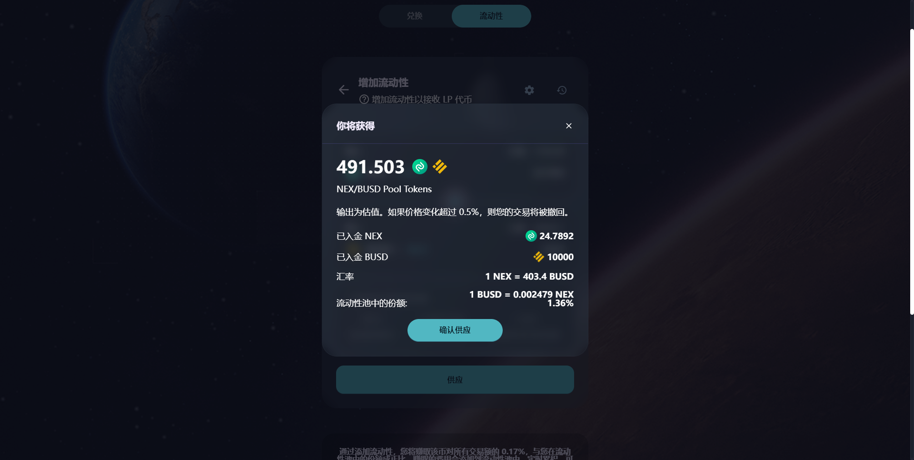
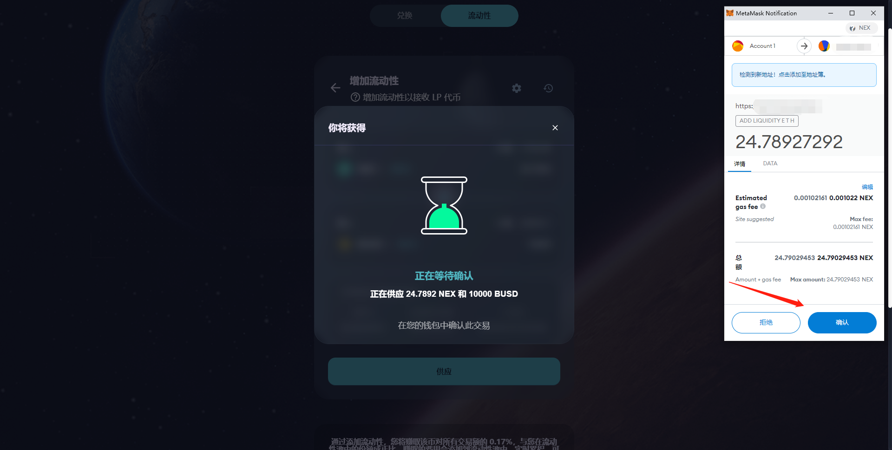
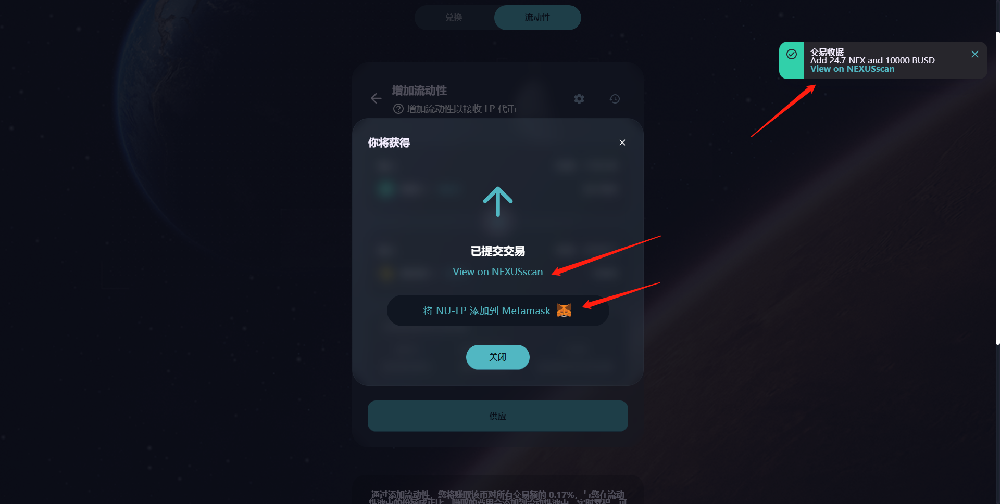

# ➕ 添加流动性

​供应币对，增加流动性，获得对应流动性代币，为兑换产品提供流动性资金池。流动性代币，不仅可以获得兑换功能所产生的手续费，还可参与流动性挖矿--农场和糖浆池。

#### 1、钱包正确连接后，进入流动性产品页面，点击【增加流动性】按钮；

#### 2、在增加流动性页面，选择币对和代币数量，点击【供应】按钮。

#### 3、在增加流动性确认弹窗中，点击【确认供应】按钮，确认交易，弹出钱包应用中的交易确认弹窗，点击【确认】按钮，合约执行交易，区块进行确认；

#### 4、区块确认完成后，页面右上角弹出交易收据小弹窗，即代表已添加流动性成功。扣除对应数量的2种代币，获得对应的流动性代币。点击弹窗中“View on NEXUSscan”，打开新窗口跳转区块链浏览器页面，查看该兑换操作的交易详情。

