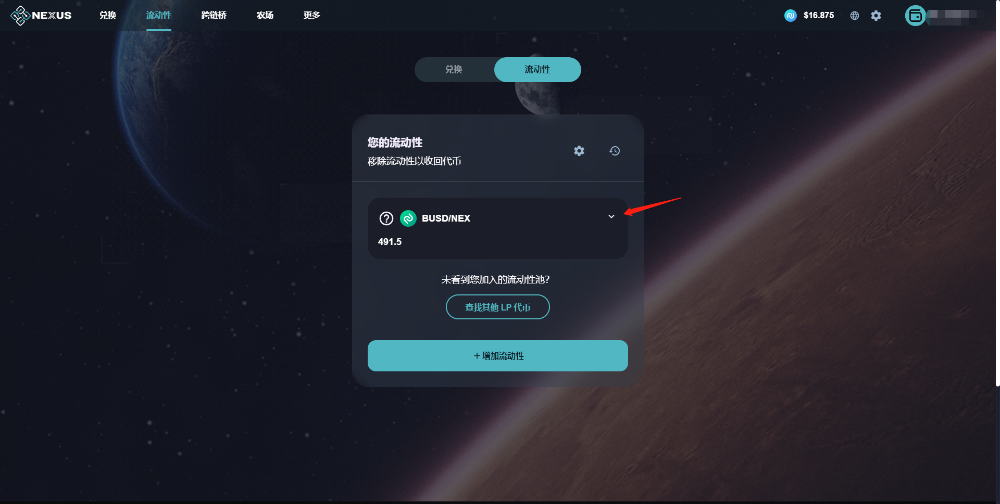
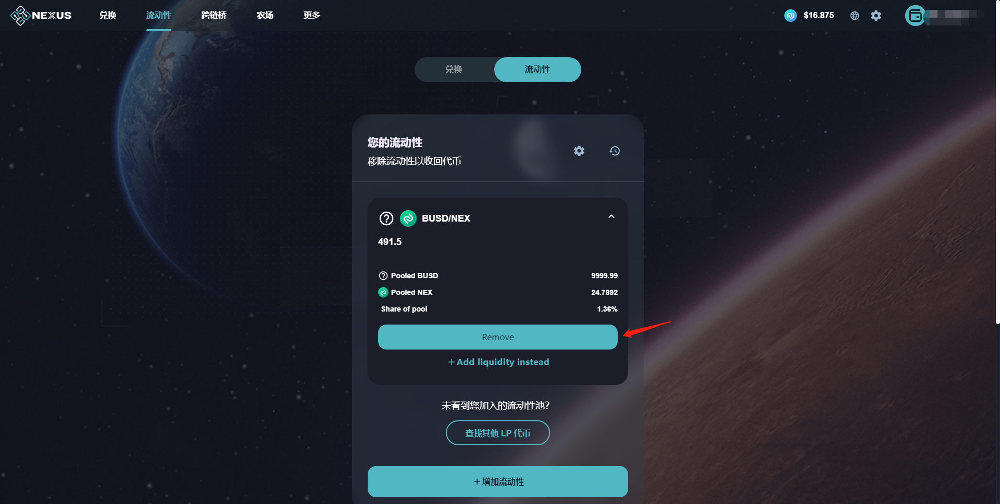
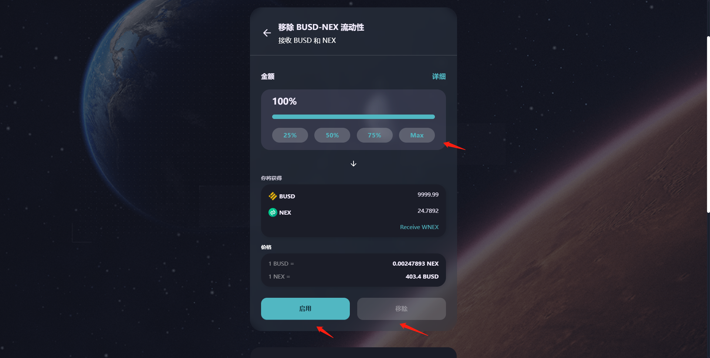
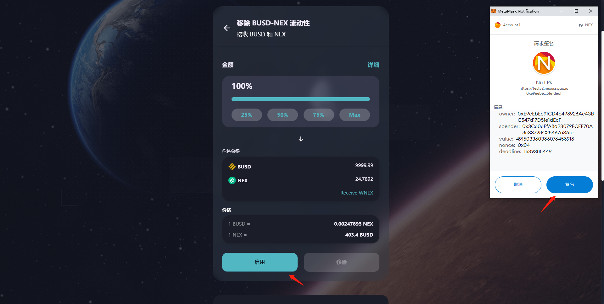
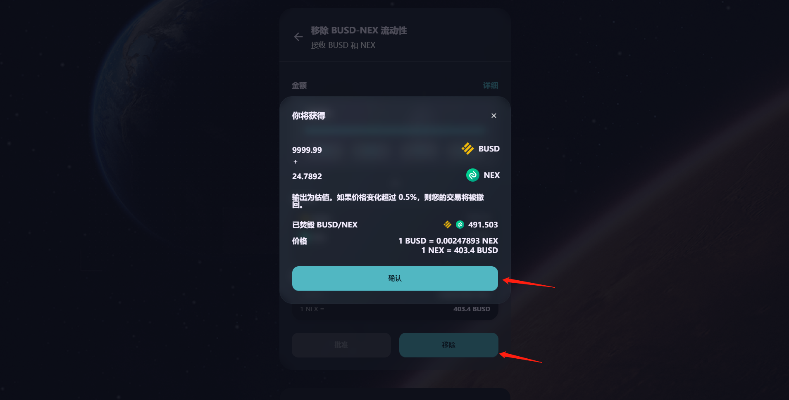
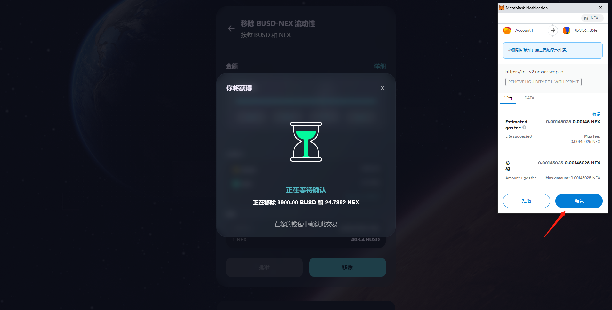
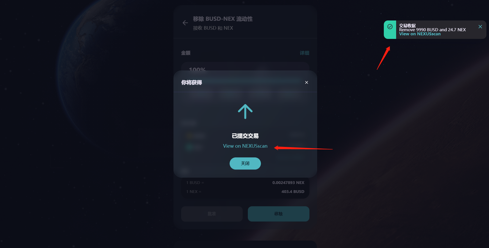

# ➖ 移除流动性

添加流动性后，获得流动性代币，流动性代币，可进行移除，换回对应的2种代币。

#### 1、钱包正确连接后，进入流动性产品页面，您可看到连接钱包已有的流动性代币情况。点击查看代币详情，点击【移除流动性】按钮，进入移除流动性操作。

#### 2、在流动性移除确认弹窗中，输入要移除的流动性代币数量，点击【启用】按钮，进行钱包签名。

#### 3、钱包签名后，【移除】按钮激活，点击【移除】按钮，进行移除交易确认，确认后，弹出钱包应用的交易确认，点击【确认】按钮，交易执行，区块进行确认；

#### 4、区块确认完成后，页面右上角弹出交易收据小弹窗，即代表移除流动性成功。扣除对应数量的流动性代币，获得对应数量的2种代币，点击弹窗中“View on NEXUSscan”，打开新窗口跳转区块链浏览器页面，查看该操作的交易详情。

1
