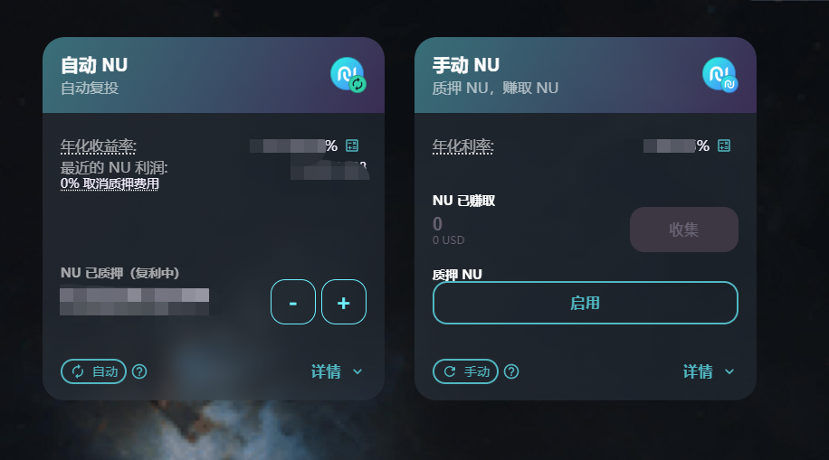
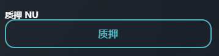
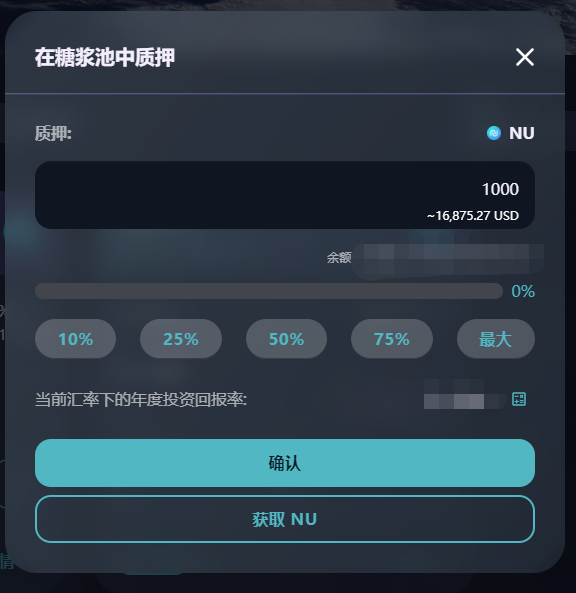
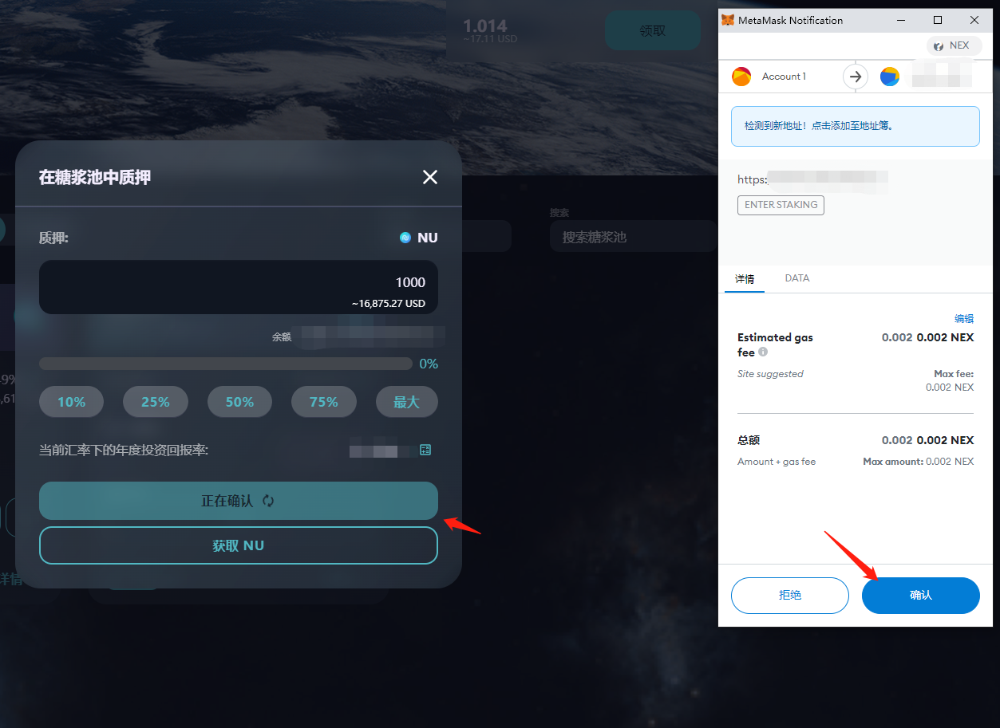
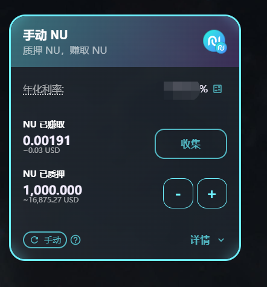
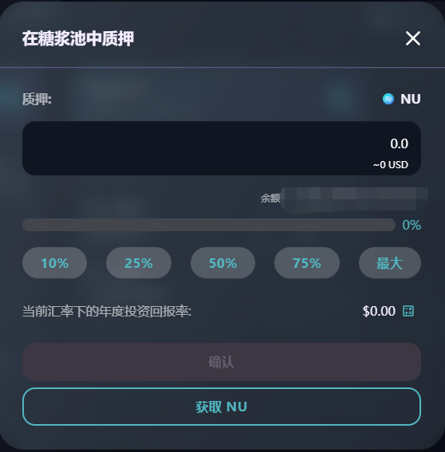
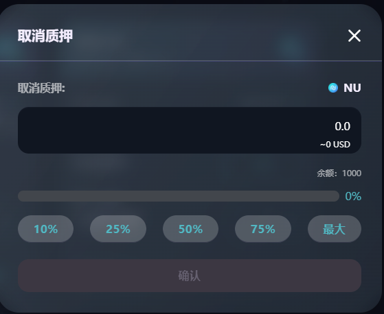

# 🌋 糖浆池

### 什么是糖浆池？

糖浆池是在 NexusSwap 上赚取免费代币最简单的方法。质押 NU，赚取免费代币！就是这么简单。

另外，还有一些特殊的糖浆池，让你质押除了 NU 之外的其他代币！

### 如何在糖浆池中质押？

在糖浆池中质押，让你在睡觉时亦可赚取 NU 或其他代币！

这比在 NexusSwap 农场中进行流动性挖矿要简单。有别于农场，你只需要质押**一种代币**即可开始赚取：通常是 NU。

#### 1、钱包正确连接后，进入糖浆池产品页面，选择一个您希望质押的糖浆池。

1、**自动 NU** 自动复投您的收益：任何赚取到的 NU，将被自动收获并重新投入回该糖浆池中。即收益在无时无刻被转化为本金，助您产生更多收益。

2、**手动 NU** 与自动 NU不同，该池不会自动帮您复投收益。您需要手动收获，并手动复投您的收益。

3、其他糖浆池让您质押 NU ，来赚取一系列非常有意思的其他项目代币。请务必了解他们。

#### 2、选择好您希望质押的糖浆池后，点击**启用**按钮，并在钱包弹出的消息中确认。

#### 3、稍等片刻，**启用**按钮将变成**质押**。点击它来打开质押菜单。

#### 4、输入您要质押的数量，或直接选择余额的百分比来选择。

#### 5、点击【确认】按钮，弹出钱包应用中的交易确认弹窗，点击【确认】按钮，合约执行交易，区块进行确认

6、现在您应该能看到糖浆池的详细质押信息。自动 NU 将展示一个倒数计时，用于提示「解除质押手续费」的收取还有多久结束。其他糖浆池将显示**收获**按钮，用于将赚取到的奖励收获至钱包内。

### **在糖浆池中添加或移除 NU** 

无论是在糖浆池中添加更多的 **NU** ，还是将 NU 提取并重新质押至更高利润的糖浆池池中，都非常容易。以下是操作指南：

1、点击 **-** （减号）来从池中提取 NU，点击 **+** （加号）来添加更多的 NU：

**请注意：**若您质押的是自动 NU 糖浆池，在质押操作后的 72 小时内，提取需要收取 0.1% 的手续费。

2、页面会弹出一个窗口，若您点击的是 **+** （加号），请在窗口中选择您要添加的 NU 数量。若您点击的是 **-** （减号） ，则选择您要提取的 NU 数量。

3、点击**确认**。

4、稍等片刻，您的质押信息将更新：\
\
**请注意：**无论是添加还是提取 NU，都会自动将待收获收益，收获至您的钱包中。
